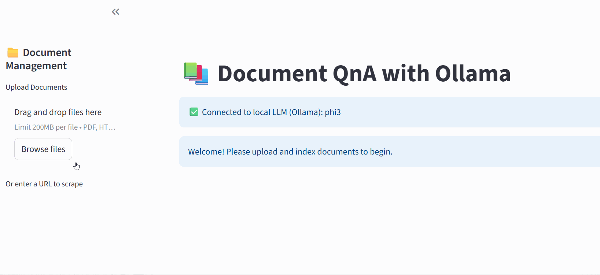
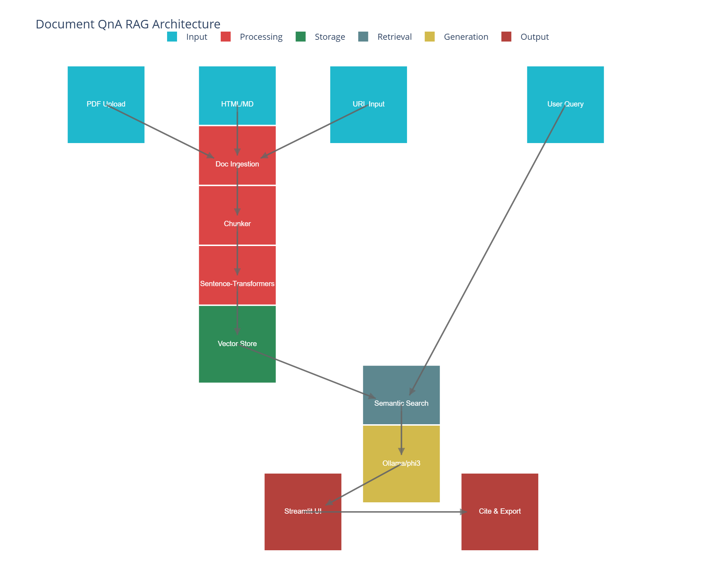

# Document QnA System with Local LLMs (Ollama phi3)
This is a local-first Question & Answer application that uses Retrieval-Augmented Generation (RAG) to answer questions about documents you upload. It runs entirely on your own system (or in a cloud environment like Google Colab) using the Ollama and the phi3 language model. It requires no API keys or external services.



## Features
- 100% Local & Private: Your documents and questions are stored and processed locally and accessible only to you.
- Multi-Format Support: Can support PDFs, Markdown files, HTML files, and can scrape text from URLs too.
- Persistent Memory: Uses a local ChromaDB vector store to remember indexed documents.
- Citations: Answers are from the provided documents and sources are shown to verify accuracy.
- Chat Interface: A Streamlit interface is used to upload files and ask questions.
- Exportable Conversations: Download your Q&A session as a Markdown file.

## Architecture


## Tech Stack
- Application Framework: Streamlit
- LLM Serving: Ollama with phi3
- Embedding Model: all-MiniLM-L6-v2 (via SentenceTransformers)
- Vector Database: ChromaDB
- Document Processing: PyMuPDF (PDFs), BeautifulSoup (HTML)

## Prerequisites
- Python 3.9+
- Ollama
- Local Setup

## Clone the repository:
- git clone [https://github.com/anadhikag/Document-QnA-using-RAG.git](https://github.com/anadhikag/Document-QnA-using-RAG.git)
- cd Document-QnA-using-RAG

## How to Run on Your Local Machine:

1. Create a virtual environment
```
python -m venv venv
source venv/bin/activate  # On Windows, use `venv\Scripts\activate`
```

2. Install dependencies:
```
pip install -r requirements.txt
```

3. Download the LLM:
```
ollama pull phi3
```

4. Run the application:
```
streamlit run app.py
```

## Running on Google Colab
If your local machine has limited RAM, you can run this entire project on a free Google Colab GPU. See the detailed Colab instructions for a step-by-step guide: https://github.com/anadhikag/Document-QnA-using-RAG/issues/1
